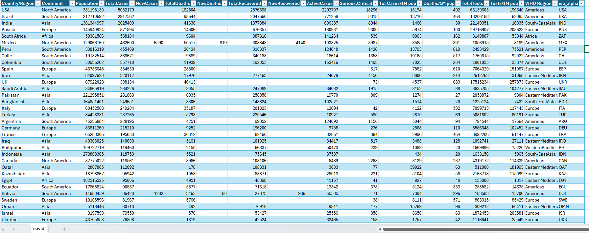
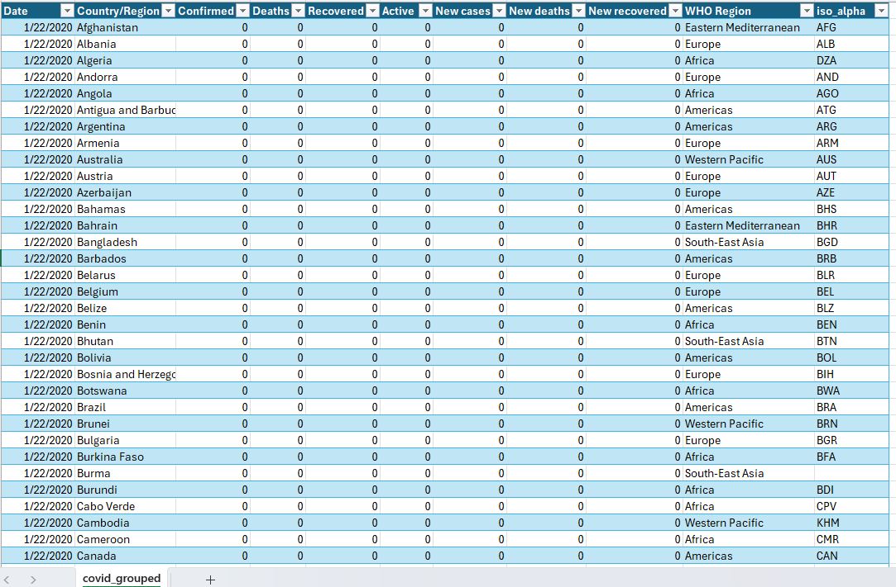
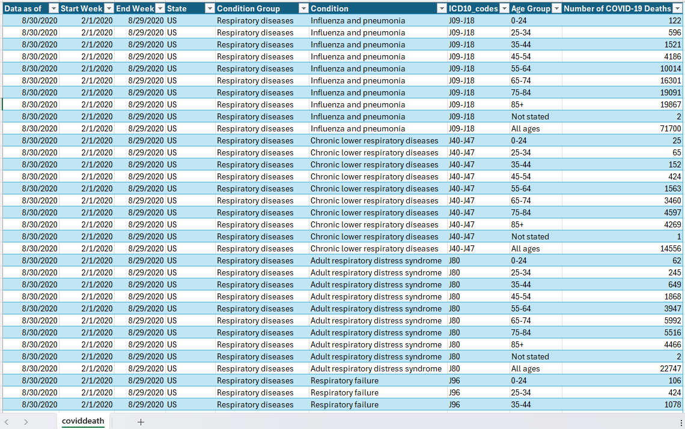

# 📑 Data Preparation

## 1. Data Examination

| CSV File          | Granularity          | Key Fields |
|-------------------|----------------------|------------|
| **coviddeath.csv**     | Weekly, US-only         | `data_as_of`, `start_week`, `end_week`, `state`, `condition_group`, `condition`, `icd10_codes`, `age_group`, `covid_deaths` |
| **covid_grouped.csv**  | Daily, Global Time Series | `date`, `country`, `confirmed`, `deaths`, `recovered`, `active`, `new_cases`, `new_deaths`, `new_recovered`, `who_region`, `iso_alpha` |
| **covid.csv**          | Latest Global Snapshot   | `country`, `continent`, `population`, `total_cases`, `new_cases`, `total_deaths`, `new_deaths`, `total_recovered`, `new_recovered`, `active_cases`, `serious_critical`, `cases_per_mil`, `deaths_per_mil`, `total_tests`, `tests_per_mil`, `who_region`, `iso_alpha` |

> **Note**: `iso_alpha` is the common identifier across global datasets. The `state` field in `coviddeath.csv` is specific to the US.

---

## 2. Data Transformation Steps

- **Standardize column names**
  - Converted to `snake_case` format for consistency.
- **Convert data types**
  - Dates → `datetime64[ns]`
  - Numerical fields → `int64` / `float64` (handle missing and empty values)
- **Create surrogate keys**
  - Generated `us_state_id` mapping for US states.
- **Build mapping dictionaries**
  - Country → ISO Alpha-3
  - US State → State ID
- **Validate data consistency**
  - Cross-check `iso_alpha` across files.
  - Ensure sum of state-level deaths matches US totals.
- **Feature engineering**
  - Added `epi_week` from `start_week`
  - Calculated `case_fatality_ratio = total_deaths / total_cases`
- **Handle missing values**
  - Forward-fill daily time series for smooth progression.
  - Leave future-week values as `NaN` for modeling.
- **Save transformed data**
  - Output in `.parquet` format for fast and consistent analysis.
  - Designed star-schema style:
    - `dim_country`, `dim_state`
    - `fact_covid_daily`, `fact_covid_weekly`

---

## 3. Sample Data Image

